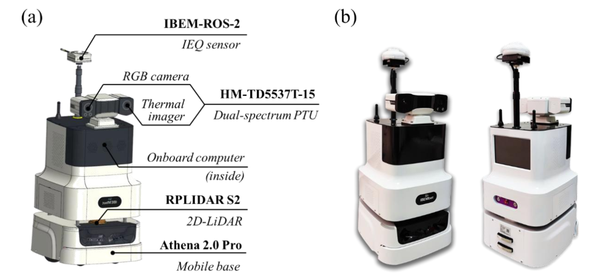
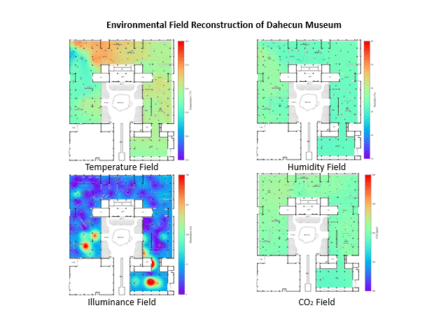
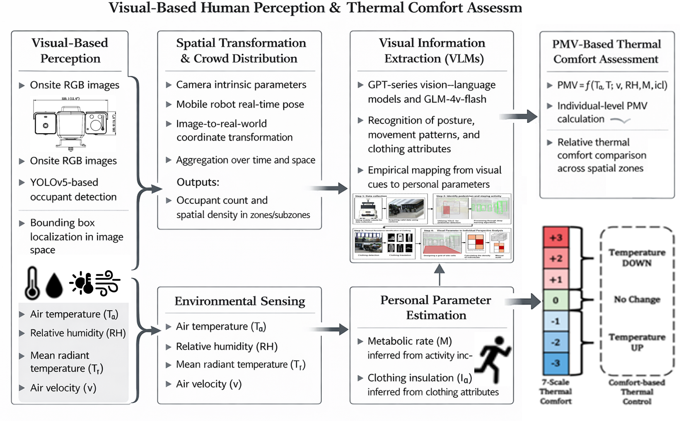

# IBEM_data: A Multi-modal Indoor Environment Dataset for Public Buildings

---

**IBEM_data** is a high-resolution, multi-modal dataset for indoor environmental research, collected via the **IBEMbot** (Intelligent Building Environment Mobile-sensing System) developed by the **School of Architecture, Tsinghua University**.

<p align="center">
  
  <br />
  <em>Figure 1: Intelligent robotic system for indoor environment monitoring.</em>
</p>

By utilizing mobile robotics, this dataset provides a unique "walk-through" perspective on indoor environments, bridging the gap between building science, mobile robotics, and occupant-centric research.

---

## 📊 Dataset Overview

The dataset covers over **50,000 $m^2$** across various climate zones and functional public spaces. The following table provides details on the core cases currently included or scheduled for release:

| Case Study (Task Area) | Building Function | Spatial Area | Duration | Climate Zone |
| :--- | :--- | :--- | :--- | :--- |
| **Daxing Airport (Terminal 1F)** | Transportation | 2,200 $m^2$ | 21 Days | Cold |
| **Daxing Airport (Terminal 4F)** | Transportation | 27,000 $m^2$ | 21 Days | Cold |
| **Dahecun Museum** | Exhibition | 11,000 $m^2$ | 16 Days | Cold |
| **CABR Innovation Center** | Office | 1,600 $m^2$ | 11 Days | Cold |
| **Digital City Hall (Haikou)** | Exhibition/Office | 1,600 $m^2$ | 5 Days | Hot-Summer/Warm-Winter |
| **Student Service Center** | Study/Self-study | 1,500 $m^2$ | 5 Days | Cold |
| **THU Arch. Exhibition Hall** | Mixed-use | 500 $m^2$ | 5 Days | Cold |
| **THU Multi-function Hall** | Education | 130 $m^2$ | 2 Days | Cold |

---

## 💡 Potential Applications

This dataset serves as a multi-modal sandbox integrating building physics with mobile robotics to support the following high-level intelligent tasks:

### 1. Advanced Environmental Perception

* **Indoor Environmental Field Reconstruction\*:** Utilizing sparse mobile sensing data to reconstruct continuous spatial fields (e.g., $CO_2$, PM2.5, Temp) via **IDW, Kriging, Gaussian Processes (GP), or Convolutional Networks (CN)**.
* **IEQ & Occupant Comfort Evaluation\*:** Fusing environmental fields with visual/thermal imagery for **Target Detection and Classification** to assess Predicted Mean Vote (PMV/PPD).
* **Environmental Diagnosis & Expert Systems\*:** Identifying building performance issues (e.g., envelope insulation leaks or HVAC terminal malfunctions) through **Semantic Mapping** and thermal imaging analysis.
* **Multimodal Forecasting:** Predicting future environmental states and field evolutions using temporal-spatial models like **LSTM, GNN, or Graph-based Gaussian Processes**.

<p align="center">
  
  <br />
  <em>Figure 2: Dynamic Environmental Field Reconstruction of Dahecun Museum.</em>
</p>

### 2. Autonomous Sensing & Decision Making

* **Active Sampling & Path Planning\*:** Developing algorithms that allow robots to autonomously locate areas with high environmental gradients for prioritized sampling using **A*, Dijkstra, or Semantic Navigation**.
* **Mobile-Stationary Collaborative Sensing\*:** Coordinating fixed sensors (high temporal resolution) and mobile robots (high spatial coverage) to capture comprehensive environmental features based on physical baseline tasks.
* **Building Environment Question Answering (QA):** Leveraging **Vision-Language Models (VLMs)** and **LLMs** to interact with the dataset, enabling natural language queries regarding building operational status.

<p align="center">
  
  <br />
  <em>Figure 3: Visual-based human perception and thermal comfort assessment.</em>
</p>

### 3. Smart Building Operation & Interaction

* **Demand-Oriented HVAC Optimization\*:** Driving energy-efficient "on-demand" HVAC control strategies by mapping environmental loads and real-time occupant behavior.
* **Occupant-Environment Interaction:** Mining physical correlation models between group behaviors and environmental parameter decay to support occupant-centric building design.
* **Environmental Event Response:** Utilizing mobile sensing for rapid localization and decision-making during sudden events like pollutant leaks or equipment failures.

---

## 📂 Directory Structure

The repository follows a strict spatial-temporal organization. Data is partitioned into "Rounds" to represent specific patrol cycles.

```text
IBEM_data/
├── assets
├── README.md
├── .gitignore
├── data_dahe/                         # Case: Dahecun Museum (Zhengzhou)
│   ├── light_csv/                     # Datasets including dedicated illuminance points
│   │   ├── Environmental Field/       # Scripts for spatial field generation
│   │   │   ├── field_gen_official.py
│   │   │   ├── field_gen_test.py
│   │   ├── 01_raw_data_sorting.py
│   │   ├── 02_auto_lap_segment.py
│   │   └── test_dahe_light_calibrated.csv
│   ├── nolight_csv/                   # Datasets excluding dedicated illuminance points
│   │   ├── 01_raw_data_sorting.py
│   │   ├── 02_auto_lap_segment.py
│   │   └── test_dahe_nolight_calibrated.csv
│   ├── photos/                        # [IGNORED] Raw image storage
│   └── raw_csv/                       # Original source files for Dahe Case
│       ├── point_label.csv            # Coordinates of sensing points
│       └── test_dahe_formal.csv       # Main integrated raw dataset
├── data_daxing/                       # Case: Daxing International Airport (Beijing)
│   ├── Environmental Field/           # Field reconstruction scripts
│   ├── photos/                        # [IGNORED]
│   └── raw_csv/
└── data_daxing_adaptive/              # Case: Adaptive Sensing (Stationary + Mobile)
    ├── data_processed_adaptive/       # Cleaned time-series by session
    │   ├── 0103-10.csv
    │   ├── 0103-12.csv
    │   └── ... [Files up to 0105-l9.csv omitted]
    └── raw_csv/                       # Raw adaptive patrol rounds
        ├── 20250102_1_Stationary/     # Stationary sensing session
        │   ├── RGB/
        │   └── Thermal/
        ├── 20250102_2_Mobile/         # Mobile patrol session
        ├── ... [40+ sequential patrol folders omitted]
        └── 20250105_9_Mobile/         # Final session
```

---

## 🔒 Privacy & Data Access Policy

To comply with **Privacy Protection Regulations** and **Property Management Agreements**, raw image data (RGB and Thermal) is **not** hosted in this public repository.

* **Public Data:** Includes all environmental readings, robot trajectories, processing codes, and metadata.
* **Restricted Data (Images):** If your research requires raw visual data for validation, please contact the team.

### How to Request Access

1. **Contact:** Yuan Mufeng, School of Architecture, Tsinghua University.
2. **Email:** [yuanmf21@mails.tsinghua.edu.cn]
3. **Note:** Please provide your affiliation and a brief description of your research intent. Redistribution of raw imagery is strictly prohibited.

---

## 📖 Citation

If you use **IBEM_data** in your research, please cite our work:

```bibtex
@misc{ibemdata2026,
  title={IBEM_data: A Multi-modal Mobile-Sensing Dataset for Public Building Environments},
  author={Yuan, Mufeng and Chen, Yihui},
  institution={Tsinghua University},
  year={2026},
  url={https://github.com/StevieHui/iBEM_data}
}
```
